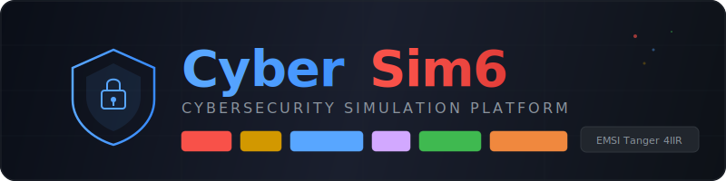

<p align="center">
  
</p>

<p align="center">
  <strong>Plateforme de Simulation de 6 Cyberattaques en Sandbox Isole</strong>
</p>

<p align="center">
  <a href="#"></a>
  <a href="#"></a>
  <a href="#"></a>
  <a href="#"></a>
  <a href="#"></a>
</p>

<p align="center">
  <a href="#-installation">Installation</a> •
  <a href="#-demo-rapide">Demo</a> •
  <a href="#-modules">Modules</a> •
  <a href="#-dashboard">Dashboard</a> •
  <a href="#-documentation">Documentation</a>
</p>

---

## A propos

**CyberSim6** est une plateforme educative de simulation de cyberattaques developpee dans le cadre du projet academique EMSI Tanger (4IIR, 2025-2026). Elle permet de simuler, detecter et analyser **6 types d'attaques** dans un environnement sandbox completement isole.

> **Objectif pedagogique** : Comprendre les mecanismes d'attaque pour mieux s'en defendre.

### Pourquoi CyberSim6 ?

- **100% Sandbox** : Toutes les attaques ciblent uniquement `localhost` avec 7 couches de securite
- **6 Modules Complets** : Attaque + Detection + Contre-mesures pour chaque type
- **Dashboard Temps Reel** : Visualisation live des attaques et des logs
- **Mode Demo Automatise** : Une seule commande pour tout tester
- **Framework NIST/MITRE** : Mapping CVE/CWE et MITRE ATT&CK pour chaque attaque
- **80 Tests Unitaires** : Suite de tests complete avec pytest

---

## Architecture

```
                    ┌─────────────────────────────────────────────┐
                    │              CyberSim6 CLI                  │
                    │         python -m cybersim <module>         │
                    └──────────────────┬──────────────────────────┘
                                       │
          ┌────────────────────────────┼────────────────────────────┐
          │                            │                            │
    ┌─────▼─────┐              ┌───────▼───────┐            ┌──────▼──────┐
    │  Attaque  │              │   Detection   │            │  Dashboard  │
    │  Modules  │              │   Modules     │            │  Web UI     │
    └─────┬─────┘              └───────┬───────┘            └──────┬──────┘
          │                            │                           │
          │    ┌───────────────────────┼───────────────────┐       │
          │    │     Unified Logging Engine (JSON/CSV)     │◄──────┘
          │    └───────────────────────┬───────────────────┘
          │                            │
    ┌─────▼────────────────────────────▼──────┐
    │           Safety Framework               │
    │  ┌─────────┐ ┌──────────┐ ┌───────────┐ │
    │  │Loopback │ │ Sandbox  │ │Anti-Path  │ │
    │  │  Only   │ │ Marker   │ │Traversal  │ │
    │  └─────────┘ └──────────┘ └───────────┘ │
    └─────────────────────────────────────────┘
```

---

## Les 6 Modules

| # | Module | Port | Attaque | Detection | MITRE |
|---|--------|------|---------|-----------|-------|
| 1 | **DDoS** | 8080 | SYN Flood, HTTP Flood | Rate monitoring, seuils | T1498, T1499 |
| 2 | **SQL Injection** | 8081 | Auth Bypass, UNION, Error, Blind | Regex patterns (9 rules) | T1190 |
| 3 | **Brute Force** | 9090 | Attaque par dictionnaire | Failed login counter | T1110 |
| 4 | **XSS** | 8082 | Reflected, Stored, DOM-based | Pattern matching (10 rules) | T1204 |
| 5 | **Phishing** | 8083 | 3 templates, campagne simulee | Scoring multi-criteres | T1566 |
| 6 | **Ransomware** | Sandbox | AES-256-CBC, note de rancon | Entropie Shannon, extensions | T1486 |

---

## Installation

### Prerequis

- Python 3.10+
- pip

### Setup

```bash
# Cloner le repository
git clone https://github.com/votre-username/cybersim6.git
cd cybersim6

# Installer les dependances
pip install -e .

# Preparer le sandbox
python -m cybersim sandbox setup
```

### Installation rapide (sans packaging)

```bash
pip install -r requirements.txt
python -m cybersim sandbox setup
```

---

## Demo Rapide

### Mode Demo Automatise (recommande)

Une seule commande pour lancer les 6 modules avec dashboard :

```bash
python -m cybersim demo
```

Cela va :
1. Demarrer les 5 serveurs cibles
2. Executer les 6 attaques sequentiellement
3. Lancer la detection pour chaque module
4. Afficher un rapport final complet
5. Ouvrir le dashboard sur `http://127.0.0.1:8888/dashboard`

### Module par module

```bash
# --- DDoS ---
python -m cybersim ddos server          # Demarrer la cible
python -m cybersim ddos http-flood      # Lancer l'attaque
python -m cybersim ddos detect          # Detection

# --- SQL Injection ---
python -m cybersim sqli server          # Serveur vulnerable
python -m cybersim sqli attack          # 4 types d'injection
python -m cybersim sqli detect          # Detection patterns

# --- Brute Force ---
python -m cybersim bruteforce server    # Serveur auth
python -m cybersim bruteforce attack    # Attaque dictionnaire
python -m cybersim bruteforce detect    # Detection

# --- XSS ---
python -m cybersim xss server           # App vulnerable
python -m cybersim xss attack           # Reflected + Stored + DOM
python -m cybersim xss detect           # Detection patterns

# --- Phishing ---
python -m cybersim phishing server      # Page de phishing
python -m cybersim phishing campaign    # Campagne simulee
python -m cybersim phishing detect      # Analyse d'indicateurs

# --- Ransomware ---
python -m cybersim ransomware encrypt --sandbox ./sandbox/test_files
python -m cybersim ransomware detect --watch ./sandbox/test_files
python -m cybersim ransomware decrypt --sandbox ./sandbox/test_files
```

### Dashboard seul

```bash
python -m cybersim dashboard            # http://127.0.0.1:8888
```

### Logs

```bash
python -m cybersim logs export --format json
python -m cybersim logs export --format csv
```

---

## Dashboard

Le dashboard web offre une visualisation temps reel :

- **4 cartes KPI** : Total events, Attaques, Detections, Modules actifs
- **Graphiques** : Events par module et par status
- **Live Feed** : Flux d'evenements en temps reel (auto-refresh 2s)
- **API REST** : `/api/stats`, `/api/events`, `/api/timeline`

Acces : `http://127.0.0.1:8888/dashboard`

---

## Securite (7 couches)

CyberSim6 est concu avec des mecanismes de securite multi-couches pour garantir que les simulations restent dans l'environnement sandbox :

| Couche | Mecanisme | Description |
|--------|-----------|-------------|
| 1 | **IP Validation** | Seul `127.0.0.1` / `localhost` est autorise comme cible |
| 2 | **Sandbox Marker** | Fichier `.cybersim_sandbox` requis dans le repertoire |
| 3 | **Anti-Path Traversal** | `resolve()` + verification de prefix |
| 4 | **Limites Ransomware** | MAX_FILES=50, MAX_SIZE=10MB, extension whitelist |
| 5 | **Confirmation Interactive** | Prompt `YES` avant chiffrement |
| 6 | **Non-Destructif** | Originaux conserves par defaut |
| 7 | **Repertoires Bloques** | Home, C:\, Windows, Program Files interdits |

---

## Tests

```bash
# Lancer tous les tests
python -m pytest tests/ -v

# Tests par module
python -m pytest tests/test_core/ -v
python -m pytest tests/test_ddos/ -v
python -m pytest tests/test_sqli/ -v
python -m pytest tests/test_xss/ -v
python -m pytest tests/test_phishing/ -v
python -m pytest tests/test_bruteforce/ -v
python -m pytest tests/test_ransomware/ -v
python -m pytest tests/test_dashboard/ -v

# Avec couverture
python -m pytest tests/ --cov=cybersim --cov-report=html
```

**80 tests** couvrant : safety, logging, config, reporter, detection (6 modules), dashboard API.

---

## Structure du Projet

```
cybersim6/
├── cybersim/
│   ├── core/                    # Infrastructure commune
│   │   ├── base_module.py       #   Classe abstraite BaseModule
│   │   ├── safety.py            #   Framework de securite (7 couches)
│   │   ├── logging_engine.py    #   Logger unifie JSON/CSV
│   │   ├── config_loader.py     #   Chargeur YAML
│   │   └── reporter.py          #   Generateur de rapports
│   ├── ddos/                    # Module DDoS
│   │   ├── target_server.py     #   Serveur HTTP cible
│   │   ├── syn_flood.py         #   Attaque SYN Flood (Scapy)
│   │   ├── http_flood.py        #   Attaque HTTP Flood
│   │   └── detection.py         #   Detection par seuils
│   ├── sqli/                    # Module SQL Injection
│   │   ├── vulnerable_server.py #   App SQLite vulnerable
│   │   ├── injection_attack.py  #   4 types d'injection
│   │   └── detection.py         #   9 patterns regex
│   ├── bruteforce/              # Module Brute Force
│   │   ├── auth_server.py       #   Serveur d'authentification
│   │   ├── dictionary_attack.py #   Attaque par dictionnaire
│   │   ├── detection.py         #   Compteur d'echecs/IP
│   │   └── wordlists/           #   Wordlists de test
│   ├── xss/                     # Module XSS
│   │   ├── vulnerable_app.py    #   App avec 4 endpoints vulnerables
│   │   ├── xss_attack.py        #   Reflected + Stored + DOM
│   │   └── detection.py         #   10 patterns + sanitize()
│   ├── phishing/                # Module Phishing
│   │   ├── phishing_server.py   #   3 templates de pages
│   │   ├── campaign.py          #   Campagne simulee (pas de vrai email)
│   │   └── detection.py         #   Scoring multi-criteres
│   ├── ransomware/              # Module Ransomware
│   │   ├── encryptor.py         #   AES-256-CBC + SHA-256
│   │   ├── decryptor.py         #   Dechiffrement + verification
│   │   ├── ransom_note.py       #   Note simulee + disclaimers
│   │   ├── detection.py         #   Entropie Shannon + extensions
│   │   └── safety_guard.py      #   Safety specifique ransomware
│   ├── dashboard/               # Dashboard Web
│   │   └── server.py            #   Serveur HTTP + UI HTML/CSS/JS
│   ├── demo.py                  # Mode demo automatise
│   └── cli.py                   # CLI unifie (argparse)
├── config/
│   └── default.yaml             # Configuration par defaut
├── sandbox/
│   ├── setup_sandbox.py         # Script de creation sandbox
│   └── test_files/              # Fichiers fictifs
├── tests/                       # 80 tests pytest
├── docs/                        # Documentation complete
│   ├── contre_mesures.md        #   Fiches contre-mesures
│   ├── guide_sensibilisation.md #   Guide de sensibilisation
│   ├── plan_reponse_incidents_irp.md  # IRP (6 scenarios)
│   └── rapport_cve_cwe_mitre.md #   CVE/CWE + MITRE ATT&CK
├── pyproject.toml               # Configuration Python moderne
├── requirements.txt             # Dependances
└── LICENSE                      # MIT
```

---

## Documentation

| Document | Description |
|----------|-------------|
| [Contre-Mesures](docs/contre_mesures.md) | Fiches Detection / Mitigation / Recuperation pour les 6 attaques |
| [Guide de Sensibilisation](docs/guide_sensibilisation.md) | IOC, bonnes pratiques, regles d'or |
| [Plan de Reponse aux Incidents](docs/plan_reponse_incidents_irp.md) | IRP NIST SP 800-61, 6 scenarios, KPI <= 15 min |
| [Rapport CVE/CWE/MITRE](docs/rapport_cve_cwe_mitre.md) | References CVE, CWE, mapping MITRE ATT&CK |

---

## Technologies

| Composant | Technologie |
|-----------|-------------|
| Langage | Python 3.10+ |
| Paquets reseau | Scapy |
| Chiffrement | PyCryptodome (AES-256-CBC) |
| Configuration | PyYAML |
| HTTP | requests + stdlib http.server |
| Base de donnees | SQLite (in-memory) |
| Tests | pytest |
| Dashboard | HTML5 / CSS3 / Vanilla JS |

---

## Equipe

| Role | Membre |
|------|--------|
| Encadrante | **Pr. Mariem Bouri** |
| Etablissement | **EMSI Tanger** - 4eme annee Ingenierie Informatique et Reseaux |
| Annee | 2025-2026 |

---

## Avertissement Legal

> **Ce projet est strictement educatif.** Toutes les attaques sont simulees dans un environnement sandbox isole (localhost uniquement). L'utilisation de ces techniques sur des systemes sans autorisation explicite est **illegale** et passible de poursuites penales.

---

## Licence

Ce projet est sous licence [MIT](LICENSE).

---

<p align="center">
  <sub>CyberSim6 - EMSI Tanger 4IIR | Projet Academique 2025-2026</sub>
</p>
