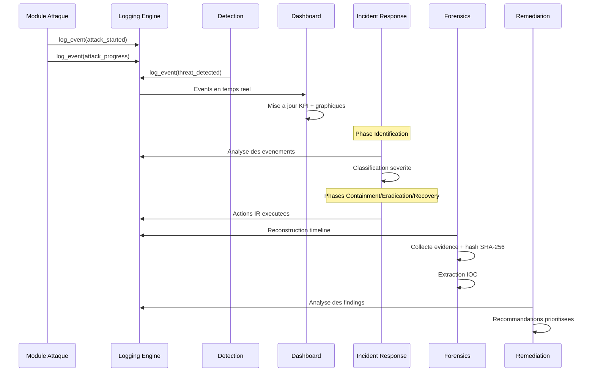
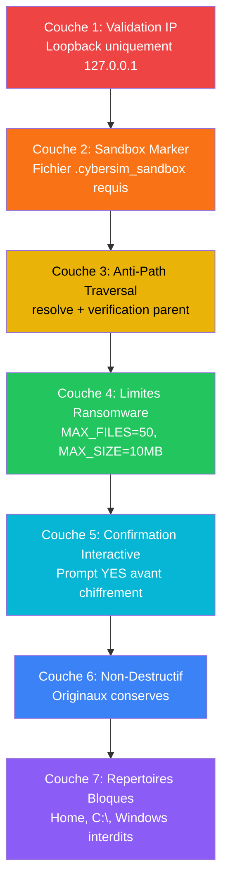

# Architecture CyberSim6

## 1. Architecture Modulaire

```mermaid
graph TD
    CLI[CLI cybersim] --> ATK[Modules Attaque]
    CLI --> DEF[Modules Defense]
    CLI --> UTL[Modules Utilitaires]

    ATK --> DDOS[DDoS<br>T1498/T1499]
    ATK --> SQLI[SQL Injection<br>T1190]
    ATK --> BF[Brute Force<br>T1110]
    ATK --> XSS[XSS<br>T1204]
    ATK --> PHISH[Phishing<br>T1566]
    ATK --> RANSOM[Ransomware<br>T1486]

    DEF --> WAF[WAF<br>50+ rules]
    DEF --> HP[Honeypot<br>Multi-trap]
    DEF --> SCAN[Scanner<br>Port TCP]

    UTL --> DASH[Dashboard<br>Real-time]
    UTL --> IR[Incident Response<br>NIST 800-61]
    UTL --> FOR[Forensics<br>Timeline/Hash]
    UTL --> REM[Remediation<br>Recommendations]
    UTL --> COMP[Compliance<br>ISO/NIST/RGPD]
    UTL --> TUT[Tutorial<br>Interactive]
    UTL --> SCN[Scenarios<br>MITRE ATT&CK]
    UTL --> RPT[Report<br>PDF]
    UTL --> PWD[Password<br>Analyzer]
    UTL --> ANO[Anomaly<br>Detection]

    CORE[Core Services] --> LOG[Logging Engine]
    CORE --> SAFE[Safety Framework]
    CORE --> AUDIT[Audit Trail]
    CORE --> THREAT[Threat Score]
    CORE --> METRICS[Detection Metrics]

    style ATK fill:#ef4444,color:#fff
    style DEF fill:#22c55e,color:#fff
    style UTL fill:#3b82f6,color:#fff
    style CORE fill:#8b5cf6,color:#fff
```

## 2. Flux d'Evenements

```mermaid
sequenceDiagram
    participant ATK as Module Attaque
    participant LOG as Logging Engine
    participant DET as Detection
    participant DASH as Dashboard
    participant IR as Incident Response
    participant FOR as Forensics
    participant REM as Remediation

    ATK->>LOG: log_event(attack_started)
    ATK->>LOG: log_event(attack_progress)
    DET->>LOG: log_event(threat_detected)
    LOG->>DASH: Events en temps reel
    DASH->>DASH: Mise a jour KPI + graphiques

    Note over IR: Phase Identification
    IR->>LOG: Analyse des evenements
    IR->>IR: Classification severite

    Note over IR: Phases Containment/Eradication/Recovery
    IR->>LOG: Actions IR executees

    FOR->>LOG: Reconstruction timeline
    FOR->>FOR: Collecte evidence + hash SHA-256
    FOR->>FOR: Extraction IOC

    REM->>LOG: Analyse des findings
    REM->>REM: Recommandations prioritisees
```

## 3. Framework de Securite (7 couches)

```mermaid
graph TB
    L1[Couche 1: Validation IP<br>Loopback uniquement 127.0.0.1]
    L2[Couche 2: Sandbox Marker<br>Fichier .cybersim_sandbox requis]
    L3[Couche 3: Anti-Path Traversal<br>resolve + verification parent]
    L4[Couche 4: Limites Ransomware<br>MAX_FILES=50, MAX_SIZE=10MB]
    L5[Couche 5: Confirmation Interactive<br>Prompt YES avant chiffrement]
    L6[Couche 6: Non-Destructif<br>Originaux conserves]
    L7[Couche 7: Repertoires Bloques<br>Home, C:\, Windows interdits]

    L1 --> L2 --> L3 --> L4 --> L5 --> L6 --> L7

    style L1 fill:#ef4444,color:#fff
    style L2 fill:#f97316,color:#fff
    style L3 fill:#eab308,color:#000
    style L4 fill:#22c55e,color:#fff
    style L5 fill:#06b6d4,color:#fff
    style L6 fill:#3b82f6,color:#fff
    style L7 fill:#8b5cf6,color:#fff
```
